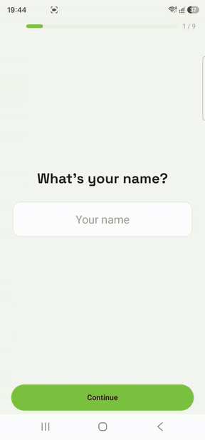

# calorie-tracker

AI-powered calorie tracker for Android. Snap a photo of your meal → Gemini Vision recognizes the food → calories & macros are logged against a personalized daily goal. Built with React Native & Expo, no backend required.

<p align="center">
  
</p>

## Features

- **Photo-based food recognition** — one tap from camera to a logged meal; Gemini Vision splits the plate into components and Open Food Facts refines the nutrition.
- **Calorie ring home** — an info-first daily view with the remaining-calorie ring as the hero, plus protein / carbs / fat macro rings.
- **Personalized targets** — a TDEE onboarding wizard turns your age, sex, weight, height, activity level, and goal into calorie + macro targets.
- **Meal detail view** — tap any logged meal to see its components, per-item nutrition, and confidence.
- **Offline-first** — logs and settings persist locally via AsyncStorage; no account or server needed.
- **Resilient AI** — automatic Gemini model fallback and 429 retry handling keep recognition working on the free tier.

## Stack

- Expo SDK 54 (React Native 0.81, React 19), TypeScript
- NativeWind v4 (Tailwind) for styling — dark theme
- React Navigation (bottom tabs + modal stack)
- Zustand + AsyncStorage for state & local persistence (offline-capable)
- Expo Camera / Image Picker for meal photos
- Gemini Vision (food recognition) + Open Food Facts (nutrition lookup)
- lucide-react-native icons, react-native-svg charts

## Setup

```bash
npm install
cp .env.example .env   # then add your Gemini key
```

Get a free Gemini key at https://aistudio.google.com/apikey and set it in `.env`:

```
GEMINI_API_KEY=your_key_here
```

## Run

```bash
npm run android      # open on a connected device / emulator (Expo Go or dev build)
npm start            # start Metro, then scan the QR with Expo Go
```

> Camera requires a real device or a dev build (Expo Go on a physical phone works).

## Project layout

```
src/
  navigation/   bottom tabs + Scan modal
  screens/      Home, Scan, MealDetail, Onboarding, Settings
  components/    UI pieces (calorie ring, macro donuts/bars, meal rows, result card, pickers)
  store/        zustand stores (logs, settings) persisted to AsyncStorage
  services/     gemini, openFoodFacts, recognition orchestrator
  utils/        date, nutrition scaling, TDEE math, ids
  theme/        color palette (mirrors tailwind.config.js)
  types/        shared TypeScript models
```

## Build a shareable APK (EAS)

The `preview` profile in `eas.json` produces a standalone **APK** you can send to
any Android phone (no Play Store needed).

```bash
npm i -g eas-cli         # or use npx eas-cli@latest below
eas login                # log in to your Expo account
eas init                 # creates the EAS project; paste the printed
                         # projectId into app.config.ts -> extra.eas.projectId
```

**Provide the Gemini key to the cloud build.** `.env` is gitignored and is *not*
uploaded, so set the key as an EAS environment variable (encrypted) for the
profiles you build:

```bash
eas env:create --name GEMINI_API_KEY --value "<your_key>" --visibility secret --environment preview
eas env:create --name GEMINI_API_KEY --value "<your_key>" --visibility secret --environment production
```

`app.config.ts` reads `process.env.GEMINI_API_KEY` at build time, so the value
flows into `extra.geminiApiKey` automatically.

Then build:

```bash
eas build -p android --profile preview
```

EAS returns a download link for the `.apk` when the build finishes. Install it by
opening the link on the phone (allow "install from unknown sources").

> A standalone build compiles native modules to match the JS exactly, so the
> Reanimated/Expo-Go limitation doesn't apply here — but the app currently uses
> no runtime Reanimated anyway.
